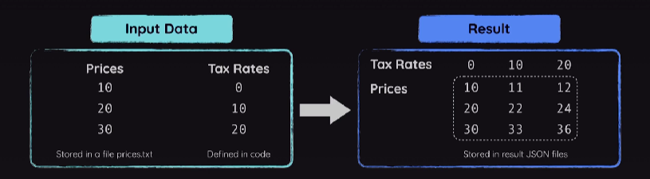

# Practice Project: Price Calculator

## Project Description:

A tool tha calculates "tax included" prices for a given list of prices & tax rates

Code will use interfaces, structs, functions, methods, file access, multiple packages & more

## Made by:

João Victor Ferrareis Ribeiro
